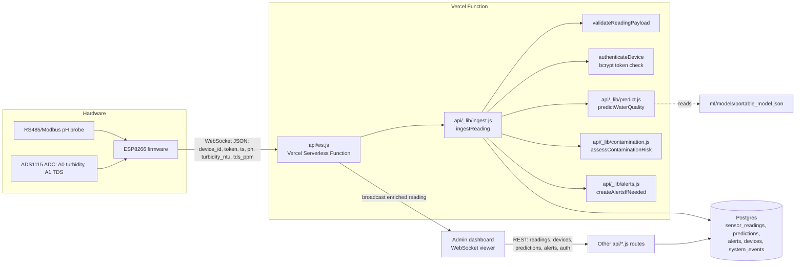

# System Architecture Overview

This document is the entry point for understanding how the Smart Water
Quality Prediction and Contamination Detection System fits together end to
end. For field-level detail, see `docs/architecture/data-contract.md`
(canonical field names) and `docs/architecture/adr-002-ml-inference-runtime.md`
(why ML inference runs as plain JavaScript rather than Python in
production).

## 1. The path a single reading takes

1. **Sensors** - an RS485/Modbus pH probe (register `0x06`) and an ADS1115
   ADC reading turbidity (channel A0) and TDS (channel A1), wired to an
   ESP8266 (`firmware/firmware.ino`).
2. **Firmware** reads all three every `READ_INTERVAL_MS` (3000ms), converts
   ADC counts to NTU/ppm via calibration curves (see
   `docs/hardware/sensors-and-wiring.md`), and sends a JSON message over a
   WebSocket connection: `{device_id, token, ts, ph, turbidity_ntu, tds_ppm}`.
   If the socket is down, the reading is buffered in RAM (ring buffer of 20)
   and flushed in order on reconnect (`docs/firmware/behavior.md`).
3. **`api/ws.js`** (a Vercel Node.js Serverless Function running a native
   WebSocket server) receives the message and passes it to
   `api/_lib/ingest.js::ingestReading`.
4. **`ingestReading`** validates the payload (`api/_lib/validation.js`),
   authenticates the device against its bcrypt-hashed token
   (`devices.device_token_hash`), persists the reading to
   `sensor_readings`, runs the trained model
   (`api/_lib/predict.js::predictWaterQuality`), assesses contamination risk
   (`api/_lib/contamination.js`), writes a row to `predictions`, creates an
   `alerts` row if warranted, and updates `devices.last_seen_at`.
5. The enriched result (raw values + `water_quality_category` +
   `prediction_confidence` + `contamination_risk`) is broadcast over the
   same WebSocket server to every connected dashboard viewer, and is also
   the return value used by the HTTP fallback path, `POST /api/readings`,
   which calls the identical `ingestReading` function.
6. The **admin dashboard** (`admin.html` + `public/js/`, documented in
   `docs/frontend/dashboard.md`) subscribes over WebSocket for a live
   indicator and also calls the REST endpoints
   (`docs/backend/api-contract.md`) for history, device management, and
   alerts.

## 2. Diagram

## 3. Why inference is plain JavaScript, not Python

The classifier is trained in Python (`ml/training/train.py`), but production
inference runs inside the same Node.js Vercel Function stack as everything
else, via a hand-written evaluator (`api/_lib/predict.js`) over a portable
JSON export (`ml/models/portable_model.json`). The full reasoning and
tradeoffs are documented in
`docs/architecture/adr-002-ml-inference-runtime.md` - this overview does not
repeat it.

## 4. Two ingestion paths, one pipeline

There are two ways a reading enters the system: the real path (WebSocket,
`api/ws.js`) and a manual/testing path (`POST /api/readings`,
`api/readings.js`). Both call the exact same `ingestReading()` function in
`api/_lib/ingest.js`, so validation, persistence, prediction, contamination
assessment, and alerting cannot drift apart between the two entry points.

## 5. Persistence and derived state

Every table in `db/migrations/0001_init.sql` is described in
`docs/database/schema.md`. Two rules worth highlighting here because they
recur throughout the docs:

- **Device status is never stored**, only derived from `last_seen_at` at
  read time (`api/_lib/devices.js::deriveDeviceStatus`).
- **`predictions` merges** what an earlier spec draft treated as two
  separate concepts ("Prediction" and "WaterQualityAssessment") into one
  table, since both describe the same underlying fact: the ML output for
  one reading.

## 6. Known scaling limitation

`api/ws.js` keeps `lastReading` and the set of connected `viewers` in
in-memory module state. Vercel's WebSocket support pins a connection to one
Function instance for its lifetime, and this state is **not** shared across
instances. For the project's actual scale (one low-traffic device plus a
handful of dashboard viewers) this is fine; see
`docs/deployment/vercel.md` and `docs/limitations/security-limitations.md`
for the documented path to a multi-instance-safe design (Redis-backed
shared state) if this ever needs to scale.
