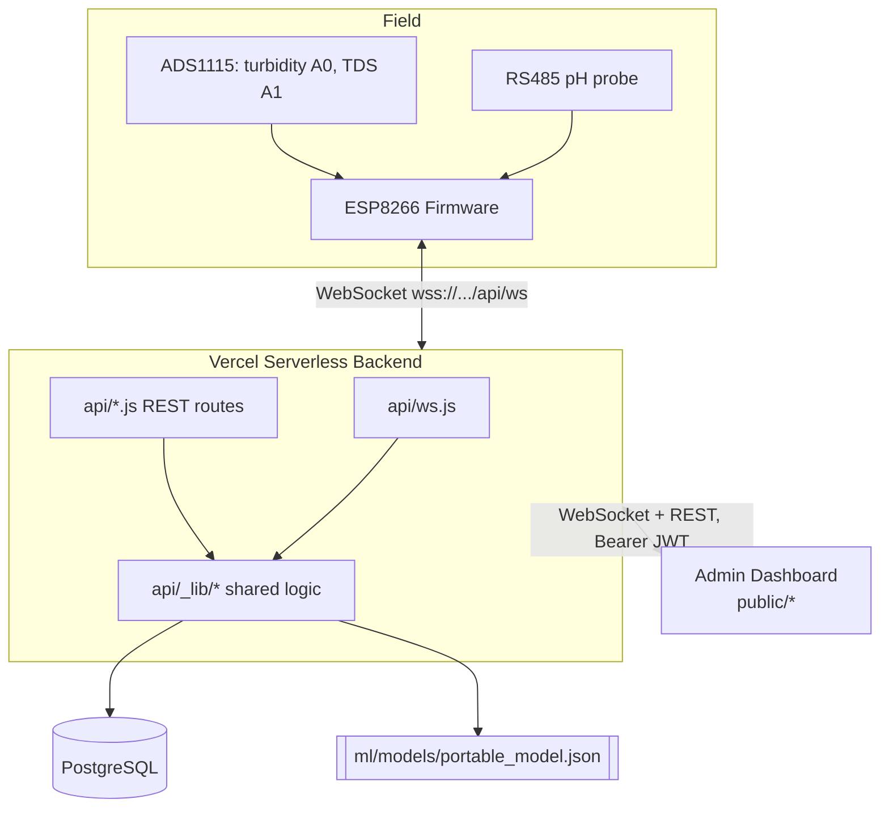

# Diagram 01: System Architecture

The complete system spans four tiers: physical sensors wired to an ESP8266,
a Vercel-hosted Node.js backend that ingests, predicts, and persists, a
Postgres database, and an admin dashboard consuming both a WebSocket stream
and a REST API. This diagram gives the top-level shape; see
`docs/architecture/overview.md` for the narrative walkthrough and
`docs/diagrams/03-software-architecture.md` for the internal component
breakdown of the backend.

Three things this diagram intentionally shows as one box each, expanded
elsewhere: the firmware's offline-buffering/reconnect behavior
(`docs/diagrams/02-iot-communication-architecture.md`), the backend's
internal module structure (`docs/diagrams/03-software-architecture.md`),
and the database's tables (`docs/diagrams/06-database-er-diagram.md`).
