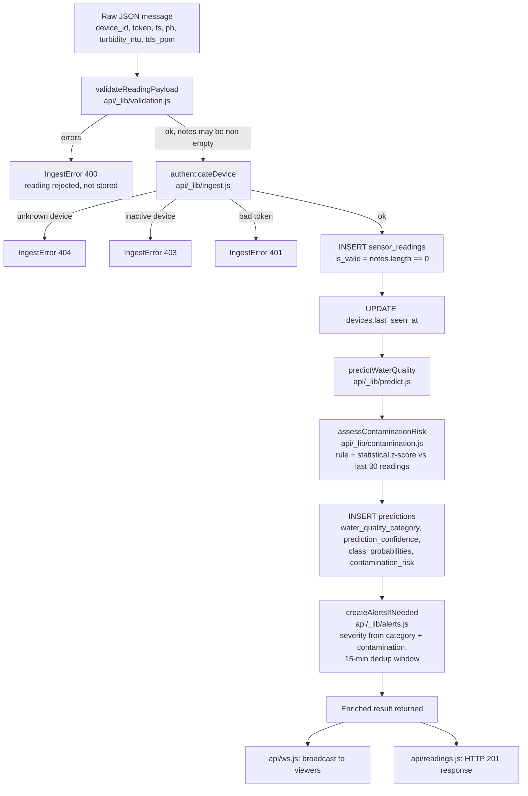

# Diagram 04: Data Pipeline

The real data flow inside `api/_lib/ingest.js::ingestReading`, from a raw
wire message to a broadcast/HTTP response. This is the single pipeline
shared by both the WebSocket path (`api/ws.js`) and the HTTP fallback path
(`POST /api/readings`).

Notes tying this to the real schema and rules:

- A reading with out-of-range-but-well-typed values (e.g. `ph: 20`) is
  **flagged, not rejected**: `is_valid = false` with `validation_notes`
  set, but it is still stored and still predicted on -
  `api/_lib/validation.js` distinguishes structural errors (rejected) from
  implausible-but-parseable values (flagged).
- Contamination assessment combines three independent signals: hard
  thresholds (`turbidity_ntu > 50`, `tds_ppm > 2000`, `ph` outside
  `[5.5, 9.5]`), a z-score check against the same device's last 30
  readings (needs at least 10 for a meaningful mean/std), and the
  predicted category itself (`Critical`/`Unsafe` alone triggers it). See
  `docs/machine-learning/contamination-detection.md`.
- Alerts are deduplicated per device: no new `alerts` row is created if an
  active one already exists for that device within the last 15 minutes.
