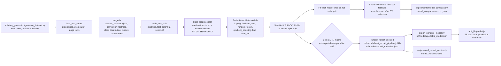

# Diagram 05: ML Pipeline

Mirrors the real structure of `ml/training/train.py`, from raw synthetic
data generation through to the artifact consumed in production. Full
narrative in `docs/machine-learning/methodology.md`.

Key sequencing facts, all enforced in code (`ml/training/train.py`):

- The preprocessor (imputer + scaler) is fit **only** on the training
  split; it is reused, never refit, for CV folds, the test set, and
  production inference.
- Model selection uses cross-validation **on the training split only**;
  the test set is scored exactly once, after the winning model is already
  chosen, and never used to pick between candidates.
- Selection for **deployment** is restricted to
  `PORTABLE_MODEL_NAMES = {logistic_regression, decision_tree,
  random_forest}` - the families `ml/inference/export_portable_model.py`
  can serialize to JSON. `gradient_boosting` scored marginally higher in
  CV in this project's run but isn't exportable, so `random_forest` was
  deployed instead. See
  `docs/architecture/adr-002-ml-inference-runtime.md` and
  `docs/machine-learning/model-comparison.md`.
