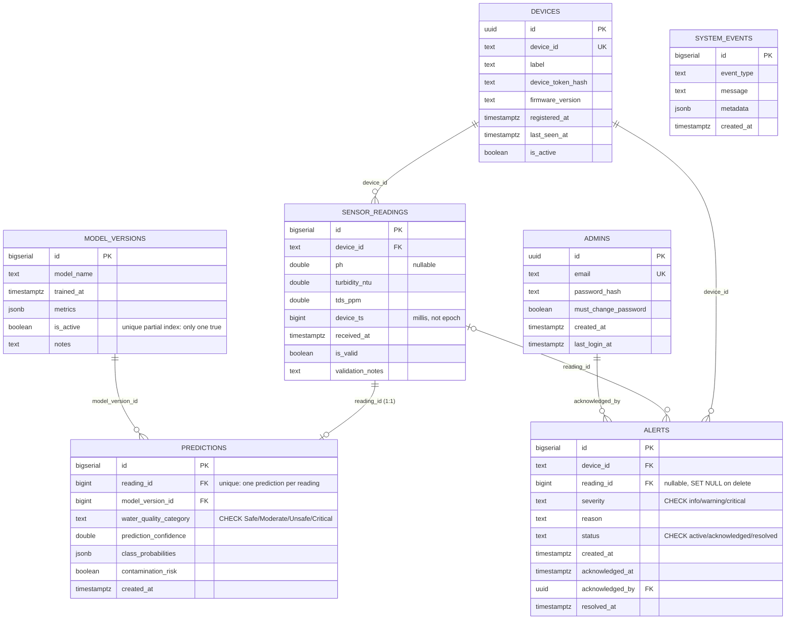

# Diagram 06: Database ER Diagram

Transcribed directly from `db/migrations/0001_init.sql`. Narrative
explanation of each table, including the "device status is derived, not
stored" rule and why `predictions` merges two spec concepts, is in
`docs/database/schema.md`.

Indexes defined in the migration (see `docs/database/schema.md` for why
each exists): `idx_sensor_readings_device_time`, `one_active_model`
(partial unique on `model_versions.is_active`), `one_prediction_per_reading`
(unique on `predictions.reading_id`), `idx_predictions_category`,
`idx_alerts_status`, `idx_system_events_time`.
