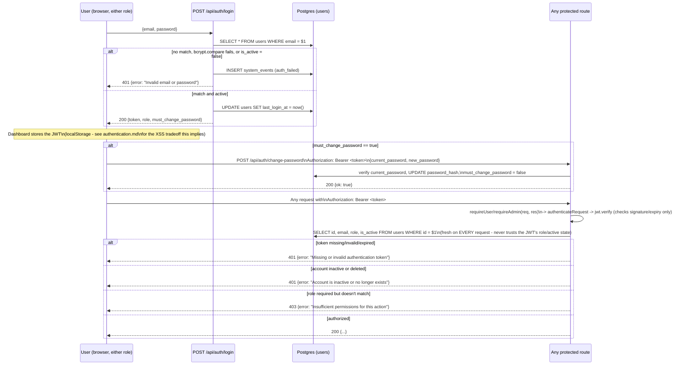

# Diagram 07: Authentication Flow

Covers the authentication flow implemented in the consolidated
`api/auth/[action].js` (login/register/me/change-password - one file, see
its header comment for why), `api/_lib/auth.js`, and
`api/_lib/http.js::requireAuth`/`requireAdmin`/`requireUser`. Full contract
detail in `docs/backend/authentication.md`.

Key real details:

- JWTs are signed with `JWT_SECRET` (HS256 via `jsonwebtoken`), expire
  after **12 hours** (`JWT_EXPIRY = '12h'` in `api/_lib/auth.js`), and carry
  `{sub, email, role}` - but the `role` claim is a convenience/debugging
  snapshot only, **never trusted for authorization**. Every protected
  request re-reads the current role and `is_active` from the database
  (the `requireAuth` step above), so a role change or account deactivation
  takes effect on the very next request, not just the next time the token
  would otherwise be re-issued. This is deliberate and tested -
  `tests/integration/auth.integration.test.js`'s "a deactivated account is
  rejected at login and on an already-issued token" case issues a token
  *before* deactivating the account and confirms that same token is
  rejected on its next use.
- `must_change_password` defaults to `false`. It's only ever forced `true`
  by `scripts/seed_admin.js` (a seeded admin gets a temporary password); a
  self-registered user (`POST /api/auth/register`, always `role: 'user'`)
  chose their own password at signup, so it's never forced for them.
- The login response is deliberately the same shape whether the account
  doesn't exist, has the wrong password, or is deactivated
  (`Invalid email or password`), to avoid leaking account
  existence/state - the real reason is still logged server-side to
  `system_events.auth_failed`.
- Two roles exist (`admin`, `user`) with no finer-grained per-admin
  permissions - see `docs/limitations/security-limitations.md`.
