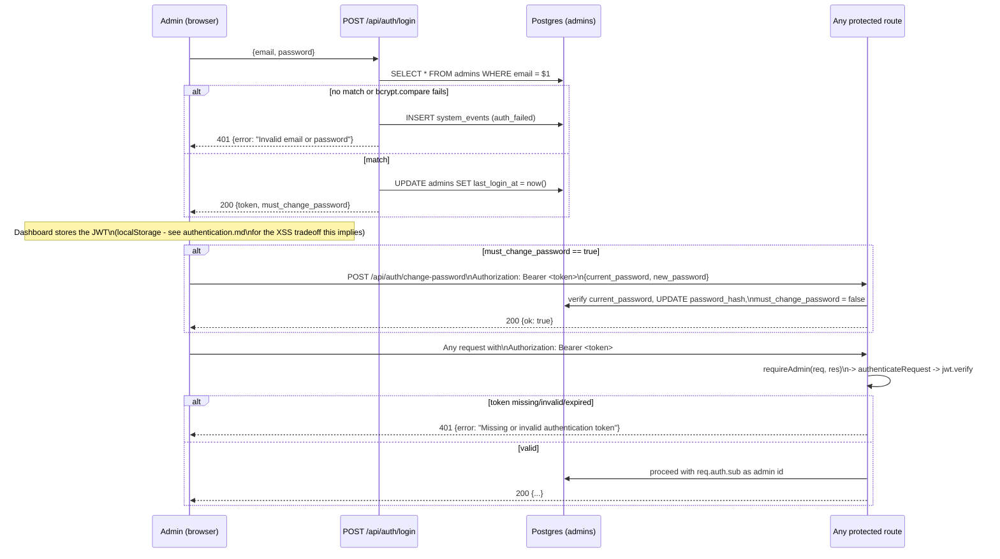

# Diagram 07: Authentication Flow

Covers the admin authentication flow implemented in `api/auth/login.js`,
`api/auth/change-password.js`, `api/auth/me.js`, `api/_lib/auth.js`, and
`api/_lib/http.js::requireAdmin`. Full contract detail in
`docs/backend/authentication.md`.

Key real details:

- JWTs are signed with `JWT_SECRET` (HS256 via `jsonwebtoken`), expire
  after **12 hours** (`JWT_EXPIRY = '12h'` in `api/_lib/auth.js`), and carry
  `{sub: admin.id, email: admin.email}`.
- `must_change_password` defaults to `true` for every newly seeded admin
  (`scripts/seed_admin.js`) and is only cleared by a successful
  `POST /api/auth/change-password` call.
- The login response is deliberately the same shape whether the email
  exists or not (`Invalid email or password`), to avoid leaking which
  emails are registered admins.
- There is exactly one admin-account model in this schema - no roles or
  per-admin permissions (see `docs/limitations/security-limitations.md`).
